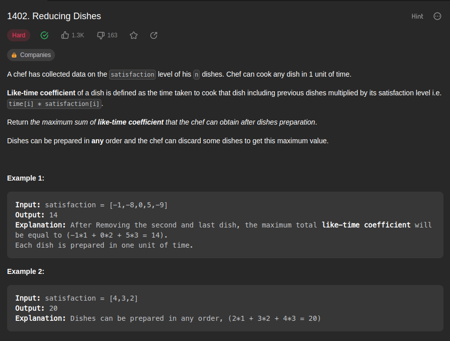
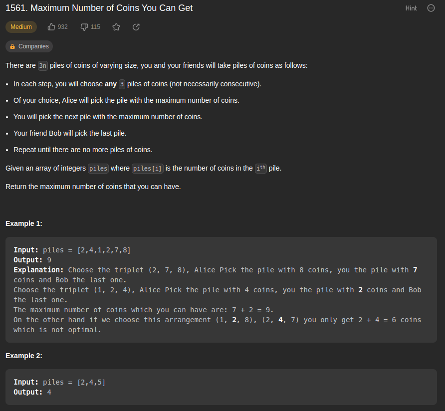
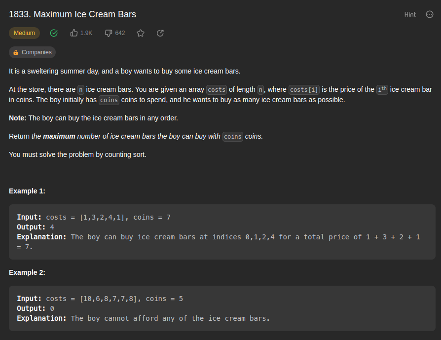
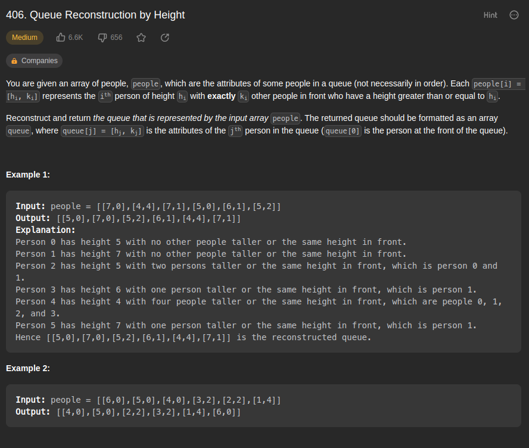

# Greed_ExerciciosResolvidos

**Número da Lista**: 4 
**Conteúdo da Disciplina**: Algoritmos Ambiciosos 

## Alunos

| Matrícula  | Aluno                         |
| ---------- | ----------------------------- |
| 17/0013987 | João Victor de Oliveira Matos |
| 17/0011119 | Geraldo Victor Alves Barbosa  |

## Sobre

Exercicios resolvidos sobre o conteúdo de Algoritmos Ambiciosos.

Foram selecionados 4 exercícios do site [leetcode](https://leetcode.com/), sendo eles:

-   [Maximum Ice Cream Bars](https://leetcode.com/problems/maximum-ice-cream-bars/description/)
-   [Reducing Dishes](https://leetcode.com/problems/reducing-dishes/description/)
-   [Queue Reconstruction by Height](https://leetcode.com/problems/queue-reconstruction-by-height/description/)
-   [Maximum Number of Coins You Can Get](https://leetcode.com/problems/maximum-number-of-coins-you-can-get/)

## Screenshots

## Apresentação

[Apresentação](assets/apresentacao.mp4)
